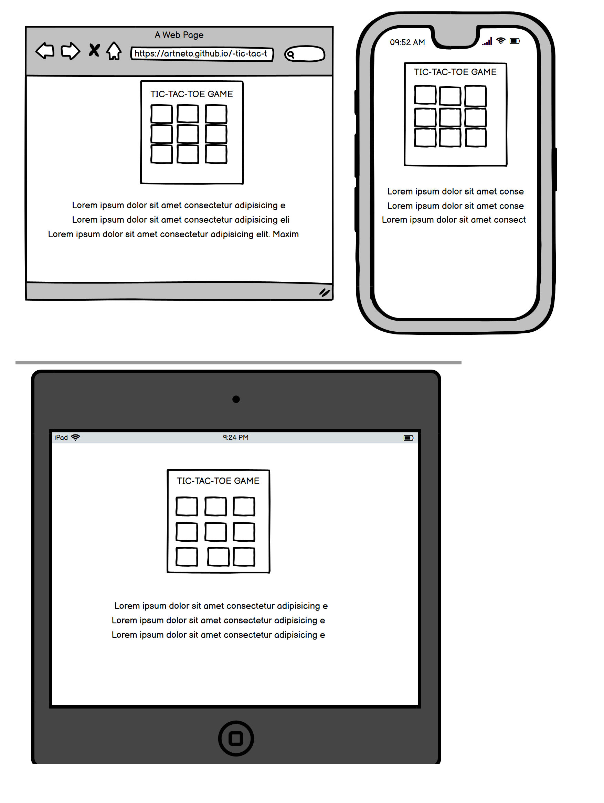

# -tic-tac-toe

Welcome to my second milestone project. I chose to make my own version of the Tic Tac Toe game for this project because I like challenge, consequently I believe this is the best choice for me.

The project is developed in HTML, CSS, and JavaScript.

[**View Tic Tac Toe website here!**](https://artneto.github.io/-tic-tac-toe/)

The users  for this game will be assigned as Player X and will play against the computer - Player O selecting the square you want to put your X into by clicking in the box. The first player to get three squares in a row wins.

This site will be targeted at people of all ages with the intention of providing excellent practice in problem solving, analytical thinking, spatial reasoning, deduction, and strategy.

## UX and Features

In order to be efficient, the header presents the game with 9 grids.
Below we highlight the rules of the game, in a simple way to understand the rules.

Once the game is complete, a black screen with a message informing the round winner and starting a new game after the countdown. 

##### User Stories
* I want a game that is clear on how to play.
* I want be able to chose the grid.
* I want to play against the computer. 
* I want to know if I got the sequence right.
* I want the game restart automatically without refreshing the page. 

#### Strategy
The objective of this project is to create interactivity and strategy between the user and the computer.

#### 1. Strategy
This project's objective is to allow users to interact with the game.

#### 2. Goals
The goal of this website is to provide a positive user experience while playing this interactive game.

#### 3. Scope
The website is responsive, allowing people to interact with it on their mobile platforms.

#### 4. Features

* Homepage
    * On the homepage there will be displayed only the game and instructions.

    * Result
    * The result will be shown after the game is completed.

    #### 5. Skeleton

* Wireframe was created using [Balsamiq](https://balsamiq.com/)

##### Home Page

